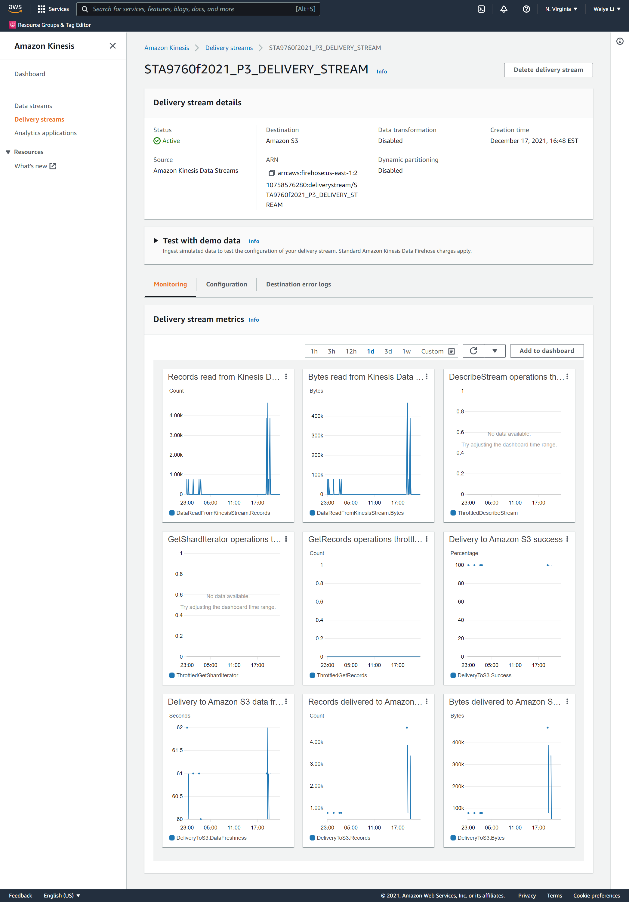
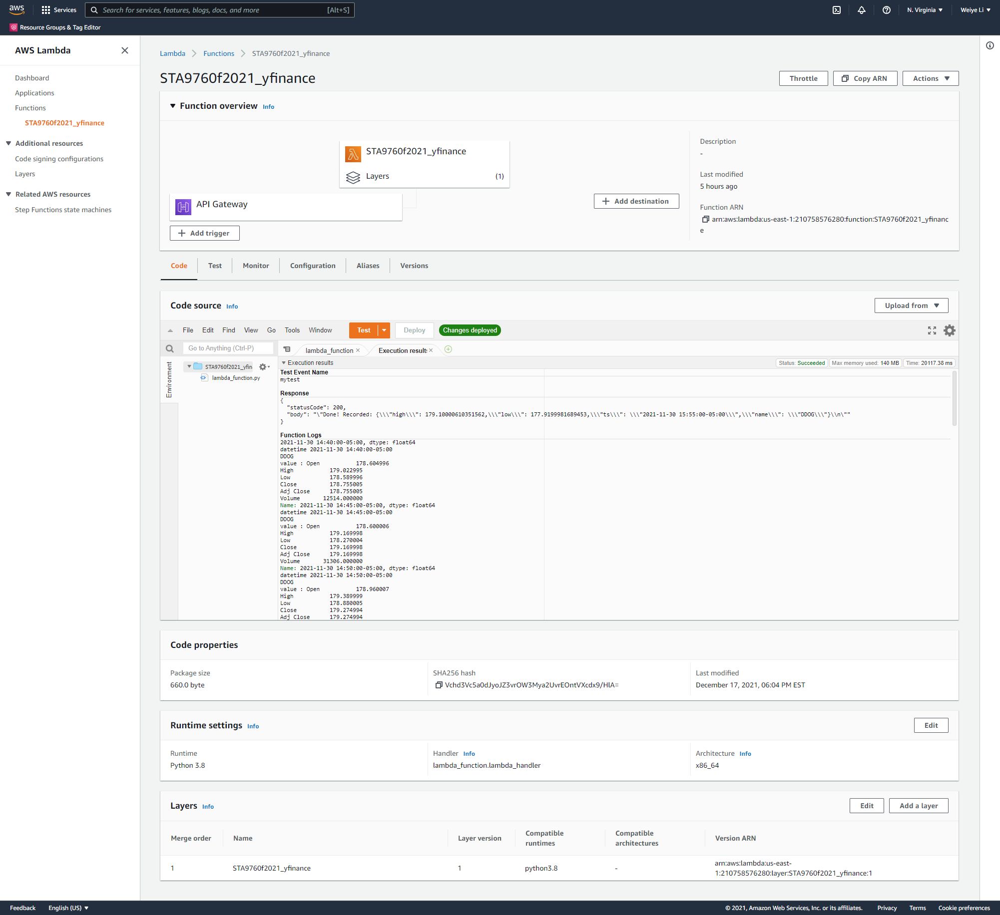
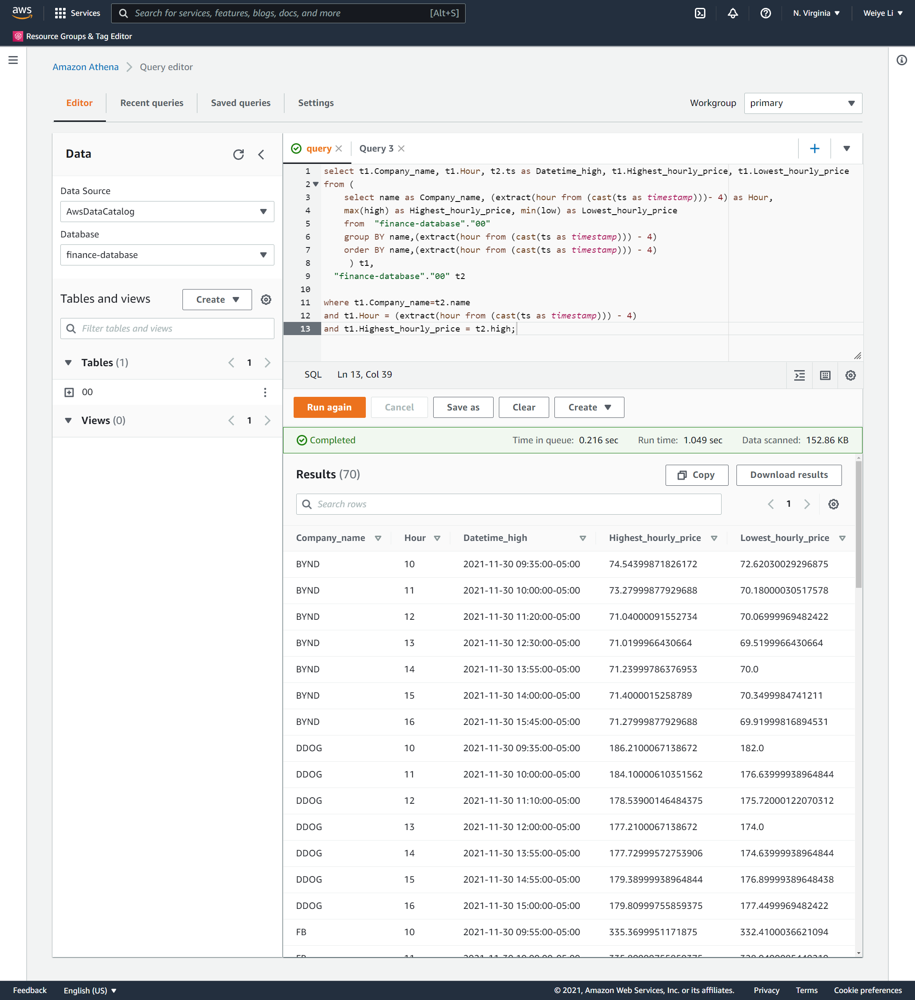
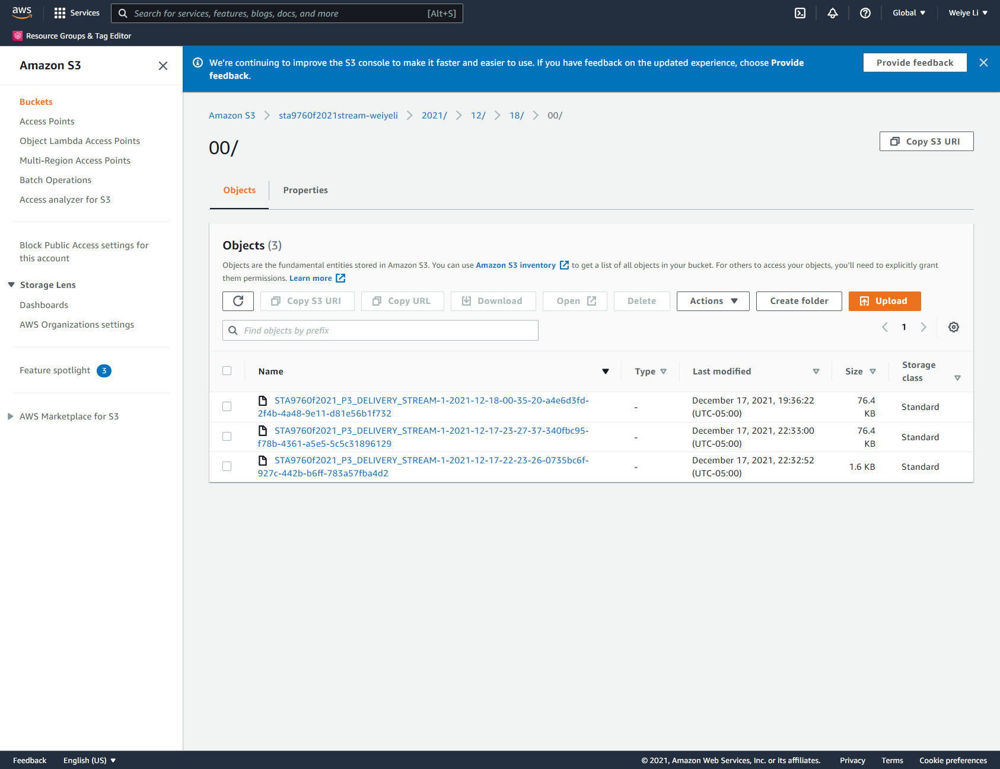

# Streaming Finance Data with AWS Lambda

For this project, I used a Lambda function to generate near real time finance data records for interactive querying. 

This project consists of three major infrastructure elements that work in tandem:
1.	A lambda function that gathers our data (Data Transformer)
2.	A Kinesis stream that holds our data (Data Collector)
3.	A serverless process that allows us to query our S3 data (Data Analyzer)

## Infrastructure

First, I created a Kinesis Delivery Stream. The process is the following:
1.Create Data Stream 
2.Create delivery stream
3.Create a new S3 bucket

## Kinesis Configuration Page

## Data Transformation
In the next step, I wrote a Lambda function that is triggered on demand. In the collector lambda, I used the yfinance module and collected one full day’s worth of stock HIGH and LOW prices for each company listed below on Tuesday, November 30th 2021, at a five minute interval. 

- Facebook (FB)
- Shopify (SHOP)
- Beyond Meat (BYND)
- Netflix (NFLX)
- Pinterest (PINS)
- Square (SQ)
- The Trade Desk (TTD)
- Okta (OKTA)
- Snap (SNAP)
- Datadog (DDOG)

As shown above, I created a layer for the lambda function and added yfinance module into it. After the function has been created, I also add the API Gateway trigger into it.

The URL of the API endpoint: https://rnz2nvmb77.execute-api.us-east-1.amazonaws.com/default/STA9760f2021_yfinance

Before starting to transfer data, I set up the Athena and configured Glue Crawler which pointed to the same S3 bucket right after it.
This allows us to interactively query the S3 files generated by the Data Transformer using AWS Athena to gain insight into streamed data.

After all preparation work is done, I began to write code that programmatically pull data in from some internet source and transfer it to Kinesis delivery stream.
The Kinesis delivery stream push the data to S3 bucket which allow us to do analyze for the further Data Analysis.

## Data Analysis
In Athena, I wrote and ran a query that gives us the highest hourly stock “high” per company from the data collected in S3 bucket.

S3 data that system collected and stored is shown as below:

For the further Data Analysis, we can download the file from Athena query and generate interesting graphs and other visualizations from it.
[Further Data Analysis](https://github.com/Weiye116/yfinance/blob/main/Analysis.ipynb)
